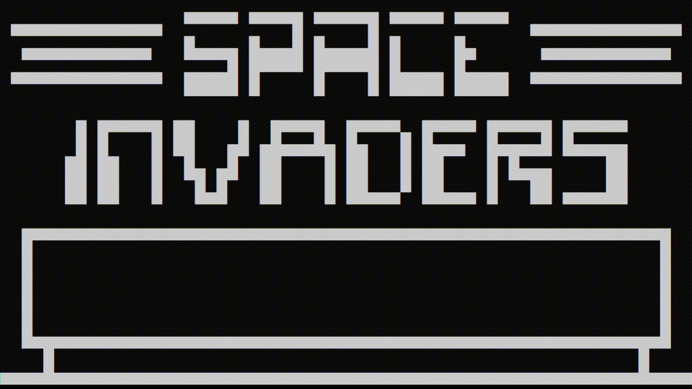

# terminal-chip8-emulator
A CHIP-8 emulator created in Python which runs in the terminal. 

NOTE: This program only works on Windows.

# Usage
`python main.py <path to ROM>` 
Example:
`python main.py ../ROMs/BRIX`

# References
Some helpful resources I used to write this emulator: 
<https://www.freecodecamp.org/news/creating-your-very-own-chip-8-emulator/> 
<http://devernay.free.fr/hacks/chip8/C8TECH10.HTM>
